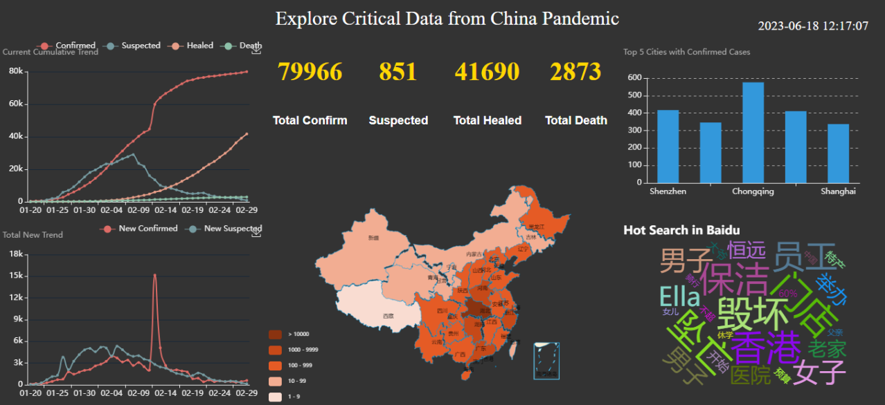
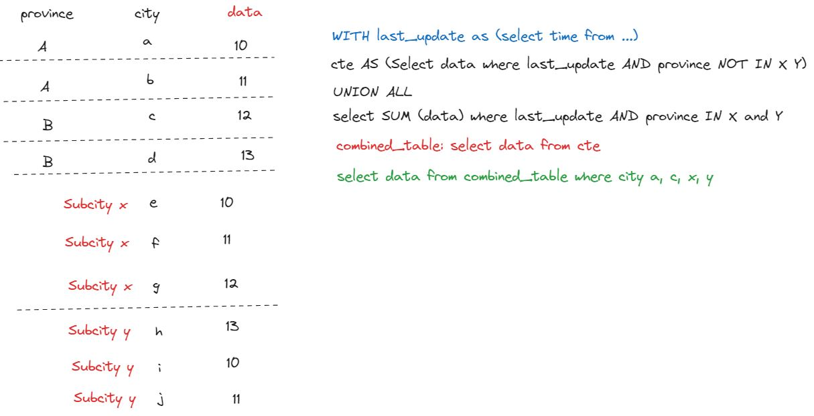

# Dashboard with Flask and ECharts

## 📊 Introduction

In this project, I built a Pandemic Dashboard with Flask and ECharts. The data was crawled from Buidu using selenium-webdriver. The scrapped data includes the pandemic history and details data. Also scrapped the hot search data with real time from Buidu Hot Search. The data was automatically stored in MySQL cloud database. After manipulating and integrating the data using SQL query and subquery(CTE), the data was mapped seamlessly to the dashboard in utils.py and app.py and controller.js files.

The dashboard with 6 mian partterns: The summary of the pandemic (center top), the pandemic number in China map view (center bottom), the updated-time cumulative trend and daily new cases trend (left), the top 5 cities with confirmed cases (right top), the current hot search (right bottom).


</img> <br>

## Tech Stack

- ✅ python 3.10
- ✅ Flask
- ✅ ECharts (Apache)
- ✅ MySQL under **clever-cloud** database
- ✅ Heidisql
- ✅ selenium
- ✅ ChromeDriver
- ✅ XPath: `find_elements`
- ✅ jquery
- ✅ Ajax
- ✅ SQL-**CTE** (Common Table Expression) / Subquery
- ✅ jieba (Chinese word segmentation for word cloud analysis)

## MySQL Database

- Database name: `history` and `details` and `hotsearch`

```sql
-- create new table
USE YourDatabaseName;
DROP TABLE IF EXISTS `history`;
CREATE TABLE `history` (
`ds` datetime NOT NULL,
`confirm` int(11) DEFAULT NULL,
`confirm_add` int(11) DEFAULT NULL,
`suspect` int(11) DEFAULT NULL,
`suspect_add` int(11) DEFAULT NULL,
`heal` int(11) DEFAULT NULL,
`heal_add` int(11) DEFAULT NULL,
`dead` int(11) DEFAULT NULL,
`dead_add` int(11) DEFAULT NULL,
PRIMARY KEY (`ds`) USING BTREE
)
ENGINE = InnoDB DEFAULT CHARSET = utf8mb4;
;
-- create new table
USE YourDatabaseName;
DROP TABLE IF EXISTS `details`;
CREATE TABLE `details` (
`id` int(11) NOT NULL AUTO_INCREMENT,
`update_time` datetime(0) DEFAULT NULL,
`province` varchar(50) DEFAULT NULL,
`city` varchar(50) DEFAULT NULL,
`confirm` int(11) DEFAULT NULL,
`confirm_add` int(11) DEFAULT NULL,
`heal` int(11) DEFAULT NULL,
`dead` int(11) DEFAULT NULL,
PRIMARY KEY (`id`) USING BTREE
)
ENGINE = InnoDB DEFAULT CHARSET = utf8mb4;
;

-- create new table
USE YourDatabaseName;
DROP TABLE IF EXISTS `hotsearch`;
CREATE TABLE `hotsearch`  (
  `id` int(11) NOT NULL AUTO_INCREMENT,
  `dt` datetime(0) DEFAULT NULL ON UPDATE CURRENT_TIMESTAMP,
  `content` varchar(255) DEFAULT NULL,
  PRIMARY KEY (`id`) USING BTREE
) ENGINE = InnoDB DEFAULT CHARSET = UTF8MB4;
```

## 📚 Learn Notes

1. ⛅ Clever Cloud: for MySQL database
   I am always huge fun for learning new cloud services, I worked with **Clever-cloud** for the this project. It has free tier for users, it is enough for our demo projects. Clever-cloud is a French company, it is a PaaS (Platform as a Service) provider. It is similar to Heroku, but it is more powerful than Heroku.

- It supports many languages, such as Java, **Node.js, PHP, Python**, Go, etc.
- It also supports many databases, such as **MySQL, PostgreSQL, MongoDB, Redis,** etc.
- It also supports many frameworks, such as **Flask**, **FASTAPI**, etc.
- It also supports many other services, such as **Docker**, etc.

I would highly recomment it, especally work with **HeidiSQL** together 👍!

**Cons and Pros:** There was bottleneck for dashboard loading data from cloud, for free tier user, there is **ONLY** 5 Max connection limit, so the data cannot show up in the dashboard when there are many subtables and figures keeping connecting to the database.

2. ✨ CTE (Common Table Expression) for contional query

```python
def get_r1_data():
    sql = "WITH latest_update AS (SELECT update_time FROM details "\
          "ORDER BY update_time DESC LIMIT 1), " \
          "cte AS (SELECT city, confirm FROM details "\
          "WHERE update_time = (SELECT update_time FROM latest_update) "\
          "AND province NOT IN ('BeiJing', 'ShangHai', 'TianJing', 'ChongQing') "\
          "UNION ALL " \
          "SELECT province AS city, SUM(confirm) AS confirm FROM details "\
          "WHERE update_time = (SELECT update_time FROM latest_update) "\
          "AND province IN ('BeiJing', 'ShangHai', 'TianJing', 'ChongQing') "\
          "GROUP BY province),"\
          "combined_table AS (SELECT city, confirm FROM cte) "\
          "SELECT city, confirm FROM combined_table "\
          "WHERE city IN ('BeiJing', 'ShangHai', 'GuangZhou', 'ShenZhen', 'ChongQing');"
```

- **CTE** (Common Table Expression) means that we can use the result of a query as a table in another query, AKA subquery factoring.
- The purpose for the above query is to get Top 5 cities ('BeiJing', 'ShangHai', 'GuangZhou', 'ShenZhen', 'ChongQing') confirmed cases in real time.
- There is problem in original database, the data for 4 cities ('BeiJing', 'ShangHai', 'TianJing', 'ChongQing') which recorded as sub-provinces, so we need to exclude them in the query firstly, then sum up the confirmed cases when the province is one of the 4 cities ('BeiJing', 'ShangHai', 'TianJing', 'ChongQing').
- **CTE** was used to create a temporary table, which combined the 4 cities and other cities together, then we can get the Top 5 cities confirmed cases.

  💡 **Note**: **CTE** is only available in MySQL 8.0 or above. I like to use subquery and CTE, make the query more logical and unit, and this is good example for using **CTE** for recommendation. 😀

- Here is the **example** for CTE (Common Table Expression) for contional query. <br>


</img> <br>

3. 📊 ECharts (Apache)

   **ECharts** is a free, powerful charting and visualization library offering an easy way of adding intuitive, interactive, and highly customizable charts to your commercial products. It is written in pure JavaScript and based on zrender, which is a whole new lightweight canvas library.

   In this project, I downloaded `echarts.min.js` and `china.js` and `worldcloud.js` as the main js files for the dashboard.

   Then, for 6 pattern with different charts-type and custom design, I downloaded the source code from [ECharts](https://echarts.apache.org/examples/en/index.html), and modified them to fit my project.
